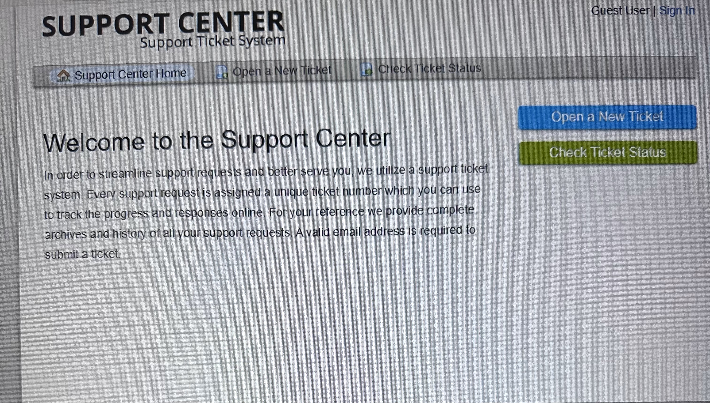

 

<h1>osTicket - Ticket Lifecycle: Intake Through Resolution</h1>
This tutorial outlines the lifecycle of a ticket from intake to resolution within the open-source help desk ticketing system osTicket. 

<h2>Environments and Technologies Used</h2>

- Microsoft Azure (Virtual Machines/Compute)
- Remote Desktop
- Internet Information Services (IIS)

<h2>Operating Systems Used </h2>

- Windows 10</b> (22H2)

<h2>Ticket Lifecycle Stages</h2>

- Intake
- Assignment and Communication
- Working the Issue
- Resolution

<h2>Lifecycle Stages</h2>

<h3>Intake - Receive and review the ticket, then collect information related to the issue</h3>

In this section, we will create a ticket and gather information regarding it. First, Log into Remote Desktop and navigate to the following links: http://localhost/osTicket/scp/login.php for Admin/Agent login, and http://localhost/osTicket for user access(no login neccessary). Let's create a ticket using the guest user, by clicking 'Open New Ticket' at the top to the right. Then fill everything out and pick a help topic which 

 

<h3>Assignment and Communication - Assign the ticket to the appropriate support agent, who will then communicate with the user who submitted the ticket</h3>

Lorem ipsum dolor sit amet, consectetur adipiscing elit, sed do eiusmod tempor incididunt ut labore et dolore magna aliqua. Ut enim ad minim veniam, quis nostrud exercitation ullamco laboris nisi ut aliquip ex ea commodo consequat. Duis aute irure dolor in reprehenderit in voluptate velit esse cillum dolore eu fugiat nulla pariatur.

 

<h3>Working the Issue - The support agent will attempt to tackle the issue</h3>

Lorem ipsum dolor sit amet, consectetur adipiscing elit, sed do eiusmod tempor incididunt ut labore et dolore magna aliqua. Ut enim ad minim veniam, quis nostrud exercitation ullamco laboris nisi ut aliquip ex ea commodo consequat. Duis aute irure dolor in reprehenderit in voluptate velit esse cillum dolore eu fugiat nulla pariatur.

 

<h3>Resolution -The issue has been resolved, the user is satisfied and the ticket is closed</h3>

Lorem ipsum dolor sit amet, consectetur adipiscing elit, sed do eiusmod tempor incididunt ut labore et dolore magna aliqua. Ut enim ad minim veniam, quis nostrud exercitation ullamco laboris nisi ut aliquip ex ea commodo consequat. Duis aute irure dolor in reprehenderit in voluptate velit esse cillum dolore eu fugiat nulla pariatur.

 

<!--- 
<h2>Video Demonstration</h2>

### [YouTube: How to create, work, and resolves tickets within osTicket](https://www.youtube.com)

--> 

